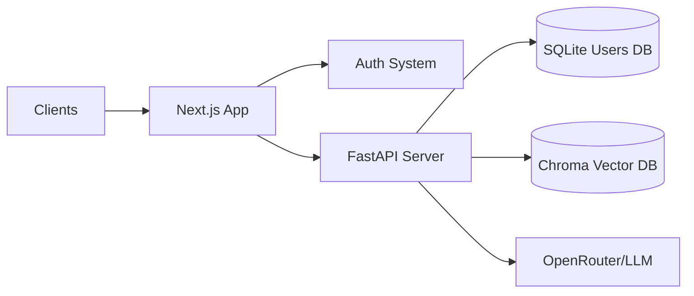

# RAG System with Auth & Admin Roles

A complete RAG (Retrieval Augmented Generation) system featuring Authentication, User Roles (Admin/Student), and File Upload capabilities. Built with Next.js (Frontend) and FastAPI (Backend).

## Features

- **Authentication**: Secure Login and Registration system using JWT.
- **User Roles**:
    - **Admin**: Can upload PDF/Text files to the knowledge base.
    - **Student**: Can chat with the AI about the uploaded knowledge.
- **Persistent RAG**: Uses ChromaDB (saved to disk) to remember uploaded files across restarts.
- **Modern UI**: Dark-themed, responsive chat interface.

## Architecture



## Prerequisites

- Python 3.8+
- Node.js 18+

## Setup Guide

### 1. Backend Setup

Navigate to the Backend directory:
```bash
cd Backend
```

Create and activate virtual environment:
```bash
python -m venv env
# Windows
.\env\Scripts\activate
# Mac/Linux
source env/bin/activate
```

Install dependencies:
```bash
pip install -r requirements.txt
# Verify bcrypt compatibility
pip install "bcrypt<4.0.0"
```

Create a `.env` file in the `Backend` directory:
```env
OPENROUTER_API_KEY=your_api_key_here
SECRET_KEY=your_super_secret_jwt_key
```

Run the server:
```bash
uvicorn app:app --reload --port 8000
```
*Server runs at `http://localhost:8000`*

### 2. Frontend Setup

Navigate to the Frontend directory:
```bash
cd frontend
```

Install dependencies:
```bash
npm install
```

Create a `.env.local` file:
```env
NEXT_PUBLIC_BACKEND_URL=http://localhost:8000
```

Run the development server:
```bash
npm run dev
```
*App runs at `http://localhost:3000`*

## How to Use

1.  **Register**: Go to `http://localhost:3000/register`.
    *   Create an **Admin** account (select role: Admin).
    *   Create a **Student** account.
2.  **Upload Knowledge (Admin)**:
    *   Login as Admin.
    *   Use the "Upload Knowledge" panel to upload PDF or Text files.
3.  **Chat (Student/Admin)**:
    *   Login.
    *   Ask questions! The AI will answer based on the files you uploaded.

## API Endpoints

| Method | Endpoint | Description | Auth Required |
| :--- | :--- | :--- | :--- |
| `POST` | `/register` | Create a new user | No |
| `POST` | `/token` | Login (Returns JWT) | No |
| `POST` | `/upload` | Upload & Index File | **Yes (Admin)** |
| `POST` | `/ask` | Chat with RAG | **Yes** |
| `GET` | `/users/me` | Get current user info | **Yes** |

## Troubleshooting

**Error: `AttributeError: module 'bcrypt' has no attribute '__about__'`**
*   **Fix**: Run `pip install "bcrypt<4.0.0"` in your backend environment. This is a known compatibility issue with `passlib`.
